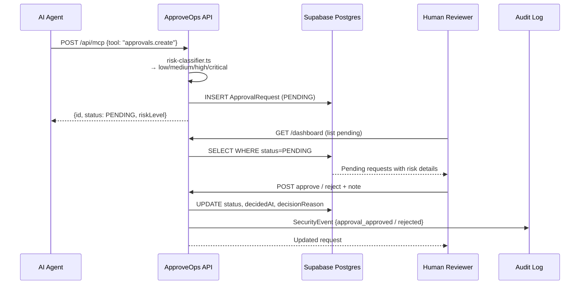
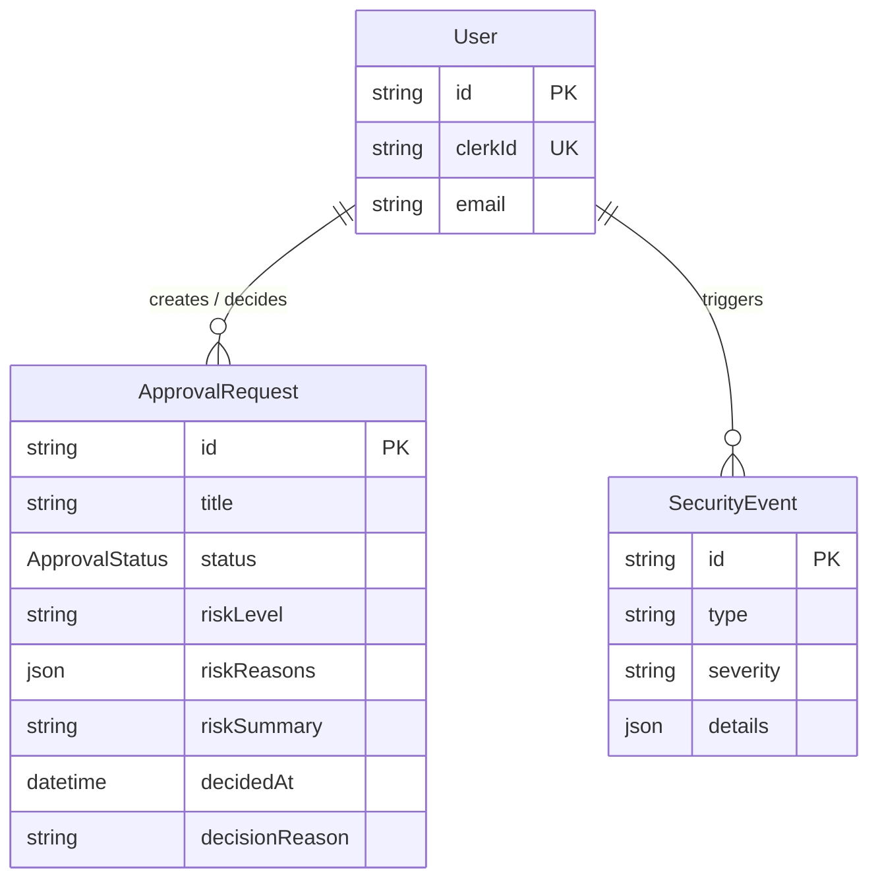

<div align="center">

# ApproveOps

**Human-in-the-loop approval gate for AI agent actions**

[](https://nextjs.org)
[](https://www.typescriptlang.org)
[](https://clerk.com)
[](https://www.prisma.io)
[](https://supabase.com)
[](https://tailwindcss.com)
[](https://vercel.com)

**[Live Demo →](https://approveops.vercel.app)**

</div>

---

## What It Does

ApproveOps puts a human in the loop for any action an AI agent wants to take. An agent submits an action, the deterministic risk classifier immediately assigns a risk level, the request lands in a pending queue, and a human approves or rejects it — with a full audit trail for every decision.

No ML inference. No black boxes. Deterministic classification, instant results.

---

## Approval Flow



---

## Risk Classification

ApproveOps classifies every action deterministically — keyword and pattern matching on the action title and description:

```
Risk Levels
├── critical  → production database operations, credential changes, force pushes
├── high      → production deployments, user data exports, infrastructure changes
├── medium    → staging changes, schema migrations, external API calls
└── low       → read-only operations, local tests, non-destructive commands
```

---

## Data Model



---

## Tech Stack

<div align="center">

&nbsp;
&nbsp;
&nbsp;
&nbsp;


</div>

---

## Quick Start

```bash
cp .env.example .env.local
# Fill in Clerk keys, Supabase connection strings, MCP secret
npm install
npm run db:generate && npm run db:push
npm run dev
```

Open [http://localhost:3000/dashboard](http://localhost:3000/dashboard).

## Environment Variables

| Variable | Description |
|---|---|
| `NEXT_PUBLIC_CLERK_PUBLISHABLE_KEY` | Clerk publishable key |
| `CLERK_SECRET_KEY` | Clerk secret key |
| `DATABASE_URL` | Supabase pooled Postgres connection string |
| `DIRECT_URL` | Supabase direct Postgres connection string |
| `MCP_API_SECRET` | Bearer token for `/api/mcp` |

---

## MCP API

Submit approval requests programmatically from any AI agent:

```bash
curl -s http://localhost:3000/api/mcp \
  -H "Authorization: Bearer $MCP_API_SECRET" \
  -H "Content-Type: application/json" \
  -d '{
    "tool": "approvals.create",
    "input": {
      "title": "Restart production worker",
      "description": "Agent wants to restart the live billing worker",
      "actor": { "id": "clerk_user_id", "email": "user@example.com" }
    }
  }'
```

Response includes `riskLevel`, `riskReasons`, and the approval URL.

---

## Demo Flow

1. Sign in at `/dashboard`
2. Submit `Drop production database` — action receives **critical** risk classification automatically
3. Review risk reasons and summary in the pending queue
4. Add an optional decision note, then approve or reject
5. Audit log shows `approval_submitted` → `approval_approved` or `approval_rejected`

---

## Project Structure

```
src/
  app/
    dashboard/          # Approval queue + audit log
    (auth)/             # Clerk sign-in / sign-up
    api/mcp/            # MCP REST endpoint
  lib/
    risk-classifier.ts  # Deterministic risk classification
    analytics.ts        # Security event persistence
    db.ts               # Prisma singleton
prisma/
  schema.prisma         # User, ApprovalRequest, SecurityEvent
```

---

## Development Scripts

```bash
npm run dev           # Start dev server
npm run build         # Production build
npm run typecheck     # TypeScript check
npm run lint          # ESLint
npm run db:generate   # Regenerate Prisma client
npm run db:push       # Push schema to DB
npm test              # Vitest unit tests
```
